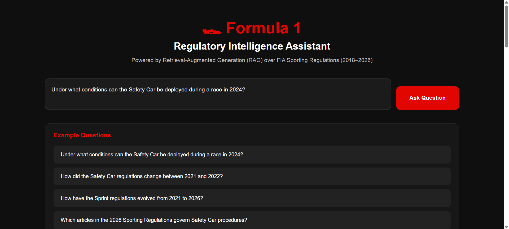
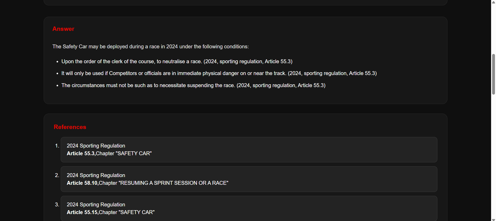
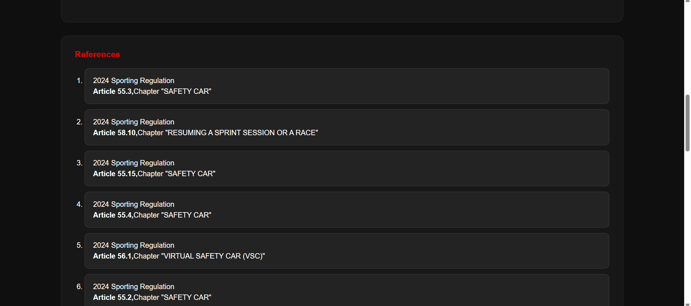

# 🏁 Formula 1 Regulatory Intelligence Assistant Powered by Retrieval-Augmented Generation (RAG)

This project implements a Formula 1 Regulatory Intelligence Assistant powered by Retrieval-Augmented Generation (RAG). 
The system allows users to ask natural language questions about FIA Formula 1 Sporting Regulations and returns accurate answers with references to the relevant regulation articles. 
It combines document parsing, chunking, hybrid retrieval using dense and sparse embeddings, multi-query retrieval, reranking, answer generation using LLM APIs, 
and a web application that provides an intuitive interface for interacting with the system.

  

## 📁 Project Structure 

```
Formula-1-Regulatory-Intelligence-Assistant-Powered-by-RAG/
│
├── data/
│   ├── documents/
│   └── qdrant_storage/
│
├── images/
│
├── notebooks/
│   ├── data_indexing.ipynb
│   └── rag_pipeline_test.ipynb
│
├── web_app/
│   ├── backend/
│   ├── frontend/
│   └── docker-compose.yml
│
├── .env
├── .gitignore
├── README.md
└── requirements.txt
```

- 
-


## 📊 Data

The knowledge base of the assistant consists of the official FIA Formula 1 Sporting Regulations covering the 2018–2026 seasons, downloaded as PDF documents from: 

https://api.fia.com/regulation/category/110

Since the PDFs contain introductory and concluding pages without regulatory content, metadata (data/documents/metadata.json) was created for each document, specifying the first and last relevant page, the regulation type, and the year. Because the 2018–2025 documents share one structure while the 2026 document follows a different one, two separate parsing functions were implemented to split each document into structured chunks. Each chunk stores the article number, chapter name, regulation content, together with its regulation type and year.

Although the current dataset only covers Sporting Regulations, every chunk explicitly stores its regulation type (e.g. "sporting"). This was done on purpose so that the assistant can be easily extended in the future to also index other FIA regulation types, such as Technical or Financial Regulations, without changing the underlying chunking, retrieval, or generation logic. 


## 🧩 Data Indexing

Data indexing is implemented in notebooks/data_indexing.ipynb and covers the following steps:

1. Document Chunking – text is extracted from each PDF and split into chunks based on the document's article/chapter structure, with the corresponding metadata attached to every chunk.
2. Creating the Vector Database – Qdrant is used as the vector database because it is fast, easy to use, and supports both dense and sparse vectors, which are required for hybrid search. Qdrant runs as a Docker container with a bind mount for persistent storage, so the same storage is later reused by the web application.
3. Creating Embeddings – since hybrid search is used, two types of vectors are generated for every chunk: dense embeddings with BAAI/bge-small-en-v1.5 and sparse embeddings with Qdrant/minicoil-v1. Embeddings are computed not only from the regulation text but also from its metadata (regulation type, year, chapter, article) to improve retrieval quality.
4. Saving Embeddings into the Database – the resulting points are upserted into the regulations collection in Qdrant.


## 🔎 Retrieval and Generation Pipeline

The retrieval and generation pipeline is implemented and tested in notebooks/rag_pipeline_test.ipynb, and the same logic is reused in the backend (web_app/backend/rag_pipeline.py). Given a user question, the pipeline performs the following steps:

1. Year Extraction – the Gemini API extracts any Formula 1 regulation years mentioned in the question (including ranges), which are later used to filter the search.
2. Multi-Query Generation – the Gemini API generates several alternative phrasings of the question to increase retrieval recall.
3. Hybrid Retrieval – for every generated query, a hybrid search is performed in Qdrant combining a dense embedding from BAAI/bge-small-en-v1.5 (captures semantic meaning, useful for paraphrased or conceptual questions) with a sparse embedding from Qdrant/minicoil-v1 (captures exact keyword and term matches, useful for precise article/terminology lookups). The two result sets are then merged using Reciprocal Rank Fusion (RRF), combining the strengths of both approaches. If any years were extracted from the question, the search is restricted to chunks from those years only.
4. Reranking – the fused results are reranked with the Cohere Rerank API (rerank-v4.0-pro) to keep only the most relevant chunks for the question. If the question involves at most one year, the top 25 chunks overall are kept; if it involves multiple years (e.g. a comparison), the top-25 budget is split evenly across the years, and reranking is run separately per year on its own chunks, so that every relevant year is guaranteed a fair share of the final context instead of being crowded out by a single year.
5. Answer Generation – the top reranked chunks are passed as context to the Gemini API together with a strict prompt that requires the model to answer only from the provided context, cite the year, regulation type and article for every statement, and clearly separate confirmed changes, unchanged regulations, and cases with insufficient information when comparing regulations across years.

```
User Question
      │
      ▼
Year Extraction (Gemini) ──► relevant years (if any)
      │
      ▼
Multi-Query Generation (Gemini) ──► N alternative queries
      │
      ▼
Hybrid Retrieval per query (Qdrant: dense + sparse, filtered to relevant years) ──► RRF fusion
      │
      ▼
Reranking (Cohere Rerank) ──► top relevant chunks
      │
      ▼
User Question + Relevant Chunks (context)
      │
      ▼
Answer Generation (Gemini)
      │
      ▼
Final Answer
```


## 🧪 Testing

The pipeline was evaluated on six standard categories of questions commonly asked about Formula 1 regulations:

| Question Type | Example Question |
|---|---|
| Fact Retrieval | Under what conditions can the Safety Car be deployed during a race in 2024? |
| Comparison | How did the Safety Car regulations change between 2021 and 2022? |
| Historical Evolution | How have the Sprint regulations evolved from 2021 to 2026? |
| Reverse Lookup | In which year was the fastest lap point removed? |
| Regulation Traceability | Which articles in the 2026 Sporting Regulations govern Safety Car procedures? |
| Scenario-Based Reasoning | A lapped driver ignored multiple blue flags and did not allow the leading car to pass during a race in 2024. According to the Sporting Regulations, should the driver receive a penalty? |

The evaluation showed that the proposed RAG pipeline performs well across different types of regulatory questions. The system accurately retrieves relevant regulations, provides article-level references, compares regulations across seasons, identifies historical changes, and applies regulations to realistic racing scenarios.

The main strengths of the system are accurate retrieval, transparent citation of sources, and reliable handling of comparison and scenario-based questions. When the required information is not available, the system correctly reports insufficient information instead of generating unsupported answers.

The main limitation is that responses to broad historical questions may include secondary regulatory changes or unnecessary details, making the answers more verbose than required. Additionally, the quality of the answers depends on the completeness of the indexed regulations.

Overall, the results demonstrate that the proposed Formula 1 Regulatory Intelligence Assistant can effectively support regulatory search, comparison, interpretation, and decision support based on FIA Sporting Regulations. 


## 💻 Web Application

The web application lets users type a question, pick from a list of example questions, or write their own. The question is sent to the backend, which runs the full RAG pipeline and returns a generated answer together with the retrieved regulation references. 








## 🛠️ Tools Used

For data indexing, retrieval, and pipeline testing:

- Python (PyMuPDF, Qdrant Client, FastEmbed, Cohere, google-genai)
- Jupyter Notebook
- Qdrant

For creating a web application:

- FastAPI
- React.js
- Qdrant
- Docker


## ⚡ Installation

1. Clone the repository: <br>

   `git clone https://github.com/TheDim0nu4/Formula-1-Regulatory-Intelligence-Assistant-Powered-by-RAG.git` <br>
   `cd Formula-1-Regulatory-Intelligence-Assistant-Powered-by-RAG` <br>
   
2. Create a .env file in the root of the project with the following variables: <br>
   ```
   GEMINI_API_KEY=your_gemini_api_key
   COHERE_API_KEY=your_cohere_api_key
   ```


## 🧠 Running Jupyter Notebooks (Conda)

1. Create a Conda environment: <br>

   `conda create -n f1_rag_env python=3.11` <br>

2. Activate the environment: <br>

   `conda activate f1_rag_env` <br>
  
3. Install project dependencies: <br>

   `python -m pip install -r requirements.txt` <br>

4. Select the environment kernel in Jupyter: <br>

  - Open the notebooks and select the kernel corresponding to the created Conda environment (f1_rag_env).
  - After selecting the kernel, you can run the notebook cells and start working with the project.

Note: both notebooks start a local Qdrant Docker container to connect to (`docker run -d --name qdrant_f1 -p 6333:6333 -v "../data/qdrant_storage:/qdrant/storage" qdrant/qdrant:v1.18.0`), and stop it at the end. Since data/qdrant_storage already contains the indexed regulations, running data_indexing.ipynb again is only required if you want to rebuild the collection from scratch.


## 🌐 Running the Web Application (Docker)

1. Open the folder with the web application: <br>

   `cd web_app` <br>
  
2. Build and run the application using Docker Compose: <br> 

   `docker compose up --build` <br> 
  
  The application will be available at the URL: http://localhost:3000 <br>
  
3. Stop the application: <br>

   `docker compose down` <br>


## ✍️ Author

The project was carried out by Dmytro Skrypchenko.


